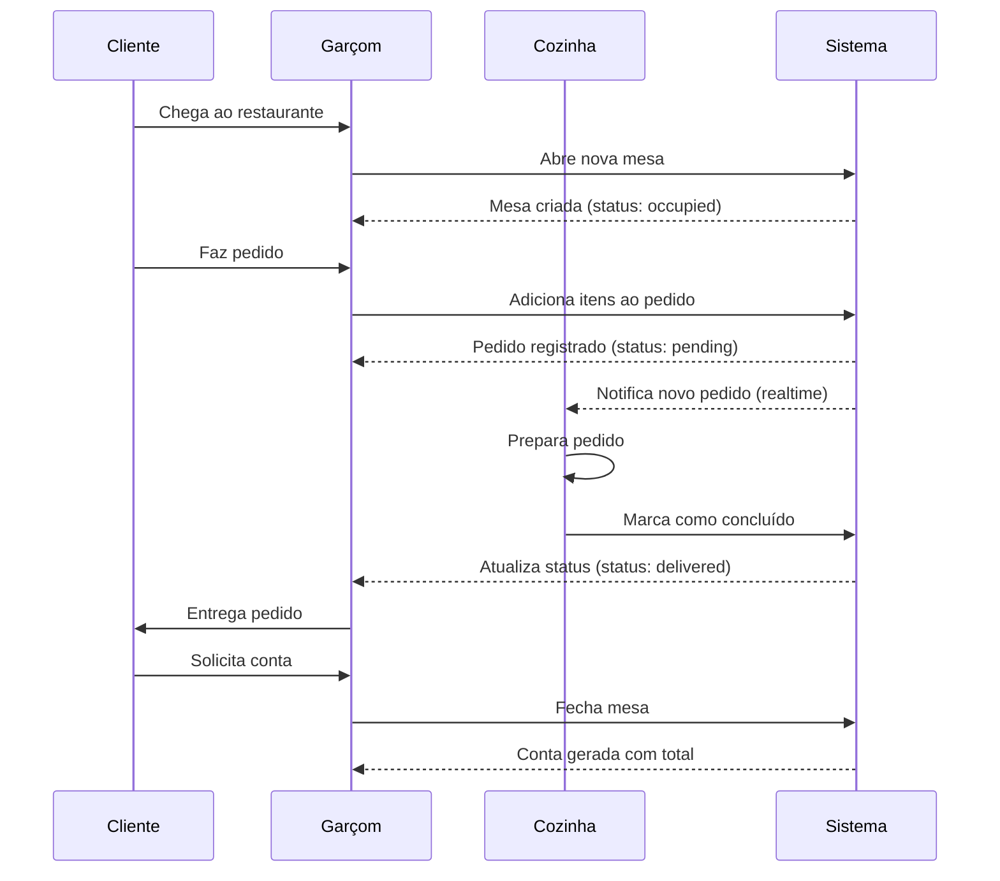
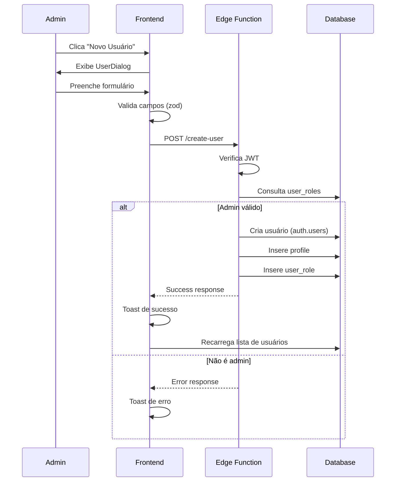
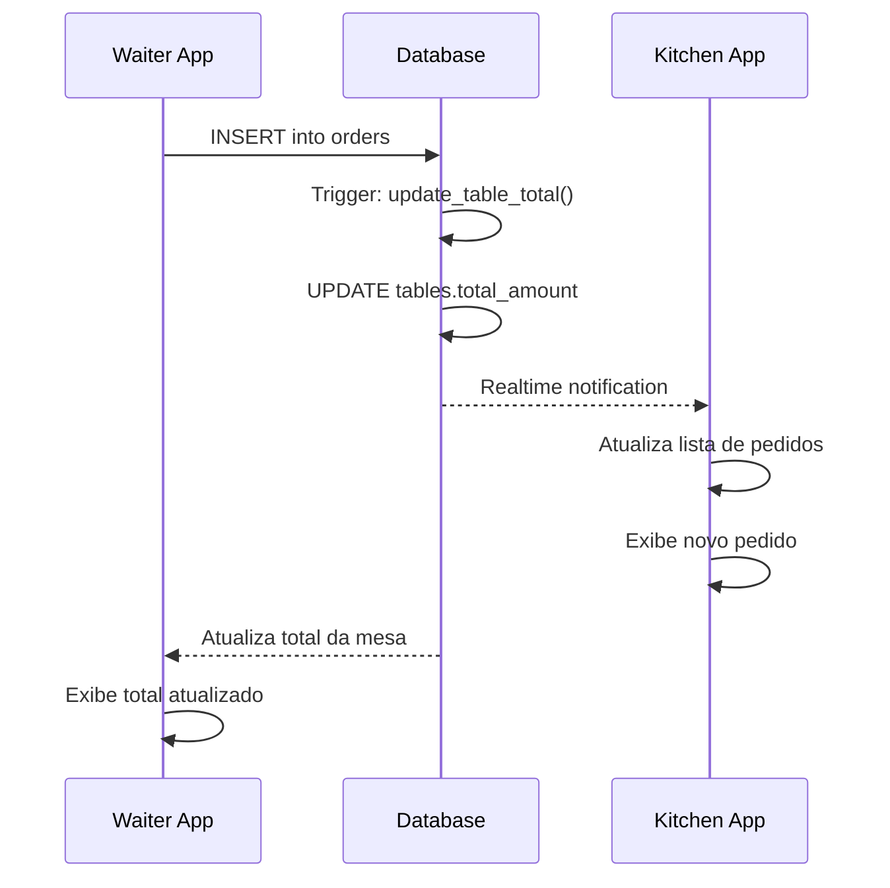
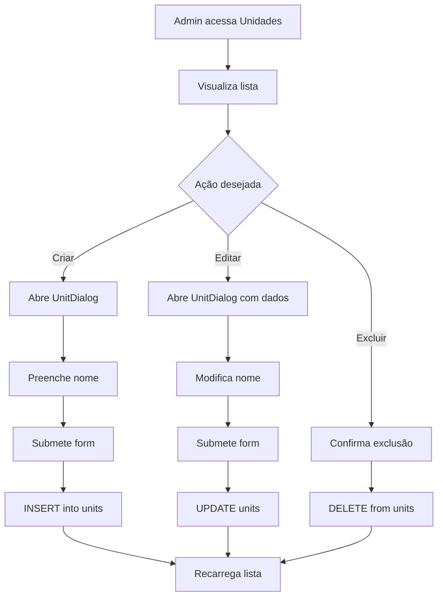

# Documentação do Sistema de Gerenciamento de Restaurante

## 📋 Índice

1. [Visão Geral](#visão-geral)
2. [Arquitetura do Sistema](#arquitetura-do-sistema)
3. [Tecnologias Utilizadas](#tecnologias-utilizadas)
4. [Estrutura do Banco de Dados](#estrutura-do-banco-de-dados)
5. [Funcionalidades por Perfil](#funcionalidades-por-perfil)
6. [Componentes Principais](#componentes-principais)
7. [Edge Functions](#edge-functions)
8. [Segurança e Autenticação](#segurança-e-autenticação)
9. [Fluxos de Trabalho](#fluxos-de-trabalho)
10. [Melhorias Implementadas](#melhorias-implementadas)

---

## 🎯 Visão Geral

Sistema completo de gerenciamento de restaurante desenvolvido com React, TypeScript e Supabase (via Lovable Cloud). O sistema implementa controle de acesso baseado em papéis (RBAC), permitindo gerenciamento de pedidos, cardápio, mesas e unidades em múltiplas localizações.

### Objetivos Principais

- **Gestão Multiusuário**: Suporte a diferentes perfis (Administrador, Garçom, Cozinha)
- **Gestão Multi-unidade**: Permite gerenciar múltiplas unidades/filiais do restaurante
- **Controle de Pedidos**: Fluxo completo desde criação até entrega
- **Segurança Robusta**: Implementação de RLS (Row Level Security) em todas as tabelas

---

## 🏗️ Arquitetura do Sistema

### Arquitetura Geral

```
┌─────────────────────────────────────────────────────────────┐
│                     Frontend (React + Vite)                  │
│  ┌──────────────┐  ┌──────────────┐  ┌──────────────┐      │
│  │    Admin     │  │    Waiter    │  │   Kitchen    │      │
│  │   Dashboard  │  │   Dashboard  │  │   Dashboard  │      │
│  └──────────────┘  └──────────────┘  └──────────────┘      │
└─────────────────────────────────────────────────────────────┘
                              │
                              ▼
┌─────────────────────────────────────────────────────────────┐
│              Supabase (Lovable Cloud Backend)               │
│  ┌──────────────┐  ┌──────────────┐  ┌──────────────┐      │
│  │ Authentication│  │   Database   │  │     Edge     │      │
│  │   + Auth      │  │   + RLS      │  │  Functions   │      │
│  └──────────────┘  └──────────────┘  └──────────────┘      │
└─────────────────────────────────────────────────────────────┘
```

### Camadas da Aplicação

1. **Camada de Apresentação** (Frontend)
   - Componentes React com TypeScript
   - Styled com Tailwind CSS e shadcn/ui
   - Routing com React Router DOM

2. **Camada de Autenticação**
   - Context API para gerenciamento de estado de autenticação
   - Proteção de rotas baseada em papéis
   - Verificação de permissões em tempo real

3. **Camada de Dados**
   - Supabase Client para comunicação com backend
   - Real-time subscriptions para atualizações instantâneas
   - RLS policies para segurança de dados

4. **Camada de Lógica de Negócio**
   - Edge Functions para operações privilegiadas
   - Triggers e Functions do PostgreSQL
   - Validações server-side

---

## 💻 Tecnologias Utilizadas

### Frontend

| Tecnologia | Versão | Propósito |
|-----------|--------|-----------|
| React | 18.3.1 | Framework UI |
| TypeScript | Latest | Type safety |
| Vite | Latest | Build tool |
| Tailwind CSS | Latest | Styling |
| shadcn/ui | Latest | Component library |
| React Router DOM | 6.30.1 | Routing |
| React Hook Form | 7.61.1 | Form handling |
| Zod | 3.25.76 | Schema validation |
| Lucide React | 0.462.0 | Icons |
| Sonner | 1.7.4 | Toast notifications |

### Backend (Lovable Cloud/Supabase)

| Tecnologia | Propósito |
|-----------|-----------|
| PostgreSQL | Database |
| Supabase Auth | Authentication |
| Row Level Security | Data security |
| Edge Functions (Deno) | Serverless functions |
| Realtime | Live updates |

---

## 🗄️ Estrutura do Banco de Dados

### Diagrama ER (Entity-Relationship)

```
┌──────────────┐         ┌──────────────┐         ┌──────────────┐
│   profiles   │         │  user_roles  │         │    units     │
├──────────────┤         ├──────────────┤         ├──────────────┤
│ id (PK)      │◄───┐    │ id (PK)      │    ┌───►│ id (PK)      │
│ full_name    │    │    │ user_id (FK) │    │    │ name         │
│ unit_id (FK) │────┼───►│ role         │    │    │ created_at   │
│ created_at   │    │    │ unit_id (FK) │────┘    └──────────────┘
│ deleted_at   │    │    │ created_at   │
└──────────────┘    │    └──────────────┘
                    │
                    │    ┌──────────────┐
                    └────│  auth.users  │
                         │  (Supabase)  │
                         └──────────────┘

┌──────────────┐         ┌──────────────┐         ┌──────────────┐
│    tables    │         │    orders    │         │ menu_items   │
├──────────────┤         ├──────────────┤         ├──────────────┤
│ id (PK)      │◄────────│ id (PK)      │    ┌───►│ id (PK)      │
│ table_number │         │ table_id (FK)│    │    │ name         │
│ client_name  │         │ menu_item_id │────┘    │ description  │
│ status       │         │ waiter_id(FK)│         │ price        │
│ waiter_id(FK)│         │ quantity     │         │ category     │
│ total_amount │         │ item_price   │         │ available    │
│ opened_at    │         │ status       │         │ image_url    │
│ closed_at    │         │ observations │         │ created_at   │
└──────────────┘         │ completed_at │         │ updated_at   │
                         │ created_at   │         └──────────────┘
                         └──────────────┘

┌──────────────┐
│ consent_log  │
├──────────────┤
│ id (PK)      │
│ table_id (FK)│
│ phone        │
│ consent_given│
│ created_at   │
└──────────────┘
```

### Tabelas Principais

#### 1. **profiles**
Armazena informações adicionais dos usuários.

```sql
CREATE TABLE profiles (
  id UUID PRIMARY KEY REFERENCES auth.users(id),
  full_name TEXT NOT NULL,
  unit_id UUID REFERENCES units(id),
  created_at TIMESTAMPTZ DEFAULT NOW(),
  deleted_at TIMESTAMPTZ -- Para soft delete
);
```

**RLS Policies:**
- ✅ Usuários podem ver perfis ativos (deleted_at IS NULL)
- ✅ Usuários podem atualizar seu próprio perfil
- ✅ Admins podem atualizar qualquer perfil

#### 2. **user_roles**
Gerencia os papéis e permissões dos usuários.

```sql
CREATE TYPE app_role AS ENUM ('admin', 'waiter', 'kitchen');

CREATE TABLE user_roles (
  id UUID PRIMARY KEY DEFAULT gen_random_uuid(),
  user_id UUID REFERENCES auth.users(id) NOT NULL,
  role app_role NOT NULL,
  unit_id UUID REFERENCES units(id),
  created_at TIMESTAMPTZ DEFAULT NOW(),
  UNIQUE(user_id, role)
);
```

**RLS Policies:**
- ✅ Usuários podem ver suas próprias roles
- ✅ Admins podem gerenciar todas as roles

**Function de Segurança:**
```sql
CREATE FUNCTION has_role(_user_id UUID, _role app_role)
RETURNS BOOLEAN
SECURITY DEFINER
AS $$
  SELECT EXISTS (
    SELECT 1 FROM user_roles 
    WHERE user_id = _user_id AND role = _role
  )
$$;
```

#### 3. **units**
Representa as diferentes unidades/filiais do restaurante.

```sql
CREATE TABLE units (
  id UUID PRIMARY KEY DEFAULT gen_random_uuid(),
  name TEXT NOT NULL,
  created_at TIMESTAMPTZ DEFAULT NOW()
);
```

**RLS Policies:**
- ✅ Usuários autenticados podem visualizar unidades
- ✅ Apenas admins podem gerenciar unidades

#### 4. **menu_items**
Itens do cardápio do restaurante.

```sql
CREATE TABLE menu_items (
  id UUID PRIMARY KEY DEFAULT gen_random_uuid(),
  name TEXT NOT NULL,
  description TEXT,
  price NUMERIC NOT NULL,
  category TEXT NOT NULL,
  available BOOLEAN DEFAULT TRUE,
  image_url TEXT,
  created_at TIMESTAMPTZ DEFAULT NOW(),
  updated_at TIMESTAMPTZ DEFAULT NOW()
);
```

**RLS Policies:**
- ✅ Todos podem ver itens disponíveis (available = true)
- ✅ Admins podem ver todos os itens
- ✅ Admins podem gerenciar itens

#### 5. **tables**
Mesas do restaurante.

```sql
CREATE TYPE table_status AS ENUM ('available', 'occupied', 'reserved');

CREATE TABLE tables (
  id UUID PRIMARY KEY DEFAULT gen_random_uuid(),
  table_number INTEGER NOT NULL,
  client_name TEXT,
  status table_status DEFAULT 'available',
  waiter_id UUID REFERENCES auth.users(id),
  total_amount NUMERIC DEFAULT 0,
  opened_at TIMESTAMPTZ,
  closed_at TIMESTAMPTZ,
  created_at TIMESTAMPTZ DEFAULT NOW()
);
```

**RLS Policies:**
- ✅ Usuários autenticados podem visualizar mesas
- ✅ Garçons e admins podem gerenciar mesas

#### 6. **orders**
Pedidos realizados nas mesas.

```sql
CREATE TYPE order_status AS ENUM ('pending', 'preparing', 'ready', 'delivered');

CREATE TABLE orders (
  id UUID PRIMARY KEY DEFAULT gen_random_uuid(),
  table_id UUID REFERENCES tables(id) NOT NULL,
  menu_item_id UUID REFERENCES menu_items(id) NOT NULL,
  waiter_id UUID REFERENCES auth.users(id) NOT NULL,
  quantity INTEGER NOT NULL DEFAULT 1,
  item_price NUMERIC NOT NULL,
  status order_status DEFAULT 'pending',
  observations TEXT,
  completed_at TIMESTAMPTZ,
  created_at TIMESTAMPTZ DEFAULT NOW()
);
```

**RLS Policies:**
- ✅ Usuários autenticados podem ver pedidos
- ✅ Garçons podem criar pedidos
- ✅ Cozinha e admins podem atualizar pedidos

**Trigger:**
```sql
-- Atualiza total da mesa automaticamente
CREATE TRIGGER update_table_total_trigger
AFTER INSERT OR UPDATE OR DELETE ON orders
FOR EACH ROW EXECUTE FUNCTION update_table_total();
```

#### 7. **consent_log**
Log de consentimento LGPD para envio de contas por SMS.

```sql
CREATE TABLE consent_log (
  id UUID PRIMARY KEY DEFAULT gen_random_uuid(),
  table_id UUID REFERENCES tables(id) NOT NULL,
  phone TEXT,
  consent_given BOOLEAN NOT NULL,
  created_at TIMESTAMPTZ DEFAULT NOW()
);
```

**RLS Policies:**
- ✅ Público pode inserir consentimento
- ✅ Admins podem visualizar logs

---

## 👥 Funcionalidades por Perfil

### 🔑 Administrador

O administrador tem acesso completo ao sistema através do painel administrativo.

#### Dashboard Principal (`/admin`)
- **Gerenciamento de Cardápio** (Tab: Cardápio)
  - ✅ Criar novos itens do cardápio
  - ✅ Editar itens existentes (nome, descrição, preço, categoria)
  - ✅ Definir disponibilidade dos itens
  - ✅ Adicionar imagens aos itens
  - ✅ Excluir itens do cardápio

- **Gerenciamento de Usuários** (Tab: Usuários)
  - ✅ Criar novos usuários (garçons, cozinha, outros admins)
  - ✅ Editar informações dos usuários
  - ✅ Atribuir papéis (admin, garçom, cozinha)
  - ✅ Associar usuários a unidades específicas
  - ✅ Desativar usuários (soft delete)
  - ✅ Visualizar todos os usuários ativos

- **Gerenciamento de Unidades** (Tab: Unidades)
  - ✅ Criar novas unidades/filiais
  - ✅ Editar nomes das unidades
  - ✅ Excluir unidades
  - ✅ Visualizar todas as unidades

#### Recursos Especiais
- Badge visual diferenciado para identificação de role
- Acesso irrestrito a todas as funcionalidades
- Capacidade de realizar operações privilegiadas via Edge Functions

### 👔 Garçom

Interface otimizada para operação rápida no atendimento.

#### Dashboard do Garçom (`/waiter`)
- **Gerenciamento de Mesas**
  - ✅ Visualizar todas as mesas e seus status
  - ✅ Abrir novas mesas
  - ✅ Registrar nome do cliente
  - ✅ Visualizar total acumulado da mesa em tempo real
  - ✅ Fechar mesas e finalizar atendimento

- **Gerenciamento de Pedidos**
  - ✅ Adicionar pedidos à mesa
  - ✅ Selecionar itens do cardápio disponível
  - ✅ Definir quantidade de itens
  - ✅ Adicionar observações especiais
  - ✅ Visualizar histórico de pedidos da mesa
  - ✅ Acompanhar status dos pedidos (pendente, preparando, pronto, entregue)

- **Recursos de Usuário**
  - ✅ Filtrado automaticamente pela unidade atribuída
  - ✅ Visualização em tempo real de atualizações
  - ✅ Interface responsiva para uso em tablets

### 👨‍🍳 Cozinha

Interface focada na produção e controle de qualidade.

#### Dashboard da Cozinha (`/kitchen`)
- **Visualização de Pedidos**
  - ✅ Lista de todos os pedidos pendentes e em preparo
  - ✅ Informações detalhadas de cada pedido:
    - Nome do item
    - Quantidade
    - Observações especiais
    - Número da mesa
    - Nome do garçom responsável
  
- **Controle de Produção**
  - ✅ Marcar pedidos como concluídos
  - ✅ Atualização automática da lista ao concluir
  - ✅ Notificações visuais (toast) de confirmação

- **Recursos Específicos**
  - ✅ Filtrado automaticamente pela unidade da cozinha
  - ✅ Atualizações em tempo real de novos pedidos
  - ✅ Interface simplificada para ambiente de produção

---

## 🧩 Componentes Principais

### Estrutura de Componentes

```
src/
├── components/
│   ├── admin/
│   │   ├── MenuManagement.tsx        # Gerenciamento do cardápio
│   │   ├── MenuItemDialog.tsx        # Modal de item do cardápio
│   │   ├── UserManagement.tsx        # Gerenciamento de usuários
│   │   ├── UserDialog.tsx            # Modal de usuário
│   │   ├── UnitsManagement.tsx       # Gerenciamento de unidades
│   │   └── UnitDialog.tsx            # Modal de unidade
│   ├── waiter/
│   │   ├── TableList.tsx             # Lista de mesas
│   │   ├── NewTableDialog.tsx        # Modal de nova mesa
│   │   └── OrderDialog.tsx           # Modal de pedidos
│   ├── ui/                            # Componentes shadcn/ui
│   └── ProtectedRoute.tsx            # Proteção de rotas
├── contexts/
│   └── AuthContext.tsx               # Context de autenticação
├── pages/
│   ├── Admin.tsx                     # Página do admin
│   ├── Waiter.tsx                    # Página do garçom
│   ├── Kitchen.tsx                   # Página da cozinha
│   ├── Auth.tsx                      # Página de login
│   ├── Bill.tsx                      # Página de conta
│   ├── Index.tsx                     # Página inicial
│   ├── NotFound.tsx                  # 404
│   └── Unauthorized.tsx              # 403
└── integrations/
    └── supabase/
        ├── client.ts                 # Cliente Supabase
        └── types.ts                  # Tipos auto-gerados
```

### Componentes Detalhados

#### 1. **AuthContext.tsx**
Context centralizado para gerenciamento de autenticação.

**Funcionalidades:**
- Gerenciamento de estado de usuário autenticado
- Verificação de papéis e permissões
- Funções de login/logout
- Loading states para operações assíncronas
- Persistência de sessão

**Hooks Expostos:**
```typescript
const {
  user,           // Usuário atual
  userRole,       // Role do usuário
  loading,        // Estado de loading
  signOut,        // Função de logout
  signIn,         // Função de login
  signUp          // Função de cadastro
} = useAuth();
```

#### 2. **ProtectedRoute.tsx**
Componente para proteção de rotas baseada em papéis.

**Funcionalidades:**
- Verifica autenticação do usuário
- Valida permissões de acesso
- Redireciona para login se não autenticado
- Redireciona para unauthorized se sem permissão

**Uso:**
```typescript
<ProtectedRoute allowedRoles={['admin']}>
  <AdminPanel />
</ProtectedRoute>
```

#### 3. **UserDialog.tsx**
Modal completo para criação e edição de usuários.

**Funcionalidades:**
- Modo criação e edição
- Validação de formulário com react-hook-form e zod
- Seleção de role via dropdown
- Seleção de unidade via dropdown
- Integração com Edge Functions para operações privilegiadas
- Feedback visual com toasts

**Campos:**
- Nome completo
- Email (somente criação)
- Senha (somente criação)
- Role (admin/garçom/cozinha)
- Unidade (opcional)

#### 4. **UnitsManagement.tsx**
Componente para listagem e gerenciamento de unidades.

**Funcionalidades:**
- Grid responsivo de cards de unidades
- Botões de ação (Editar/Excluir)
- Confirmação de exclusão
- Integração com UnitDialog
- Auto-refresh após operações

#### 5. **OrderDialog.tsx**
Modal para criação de pedidos.

**Funcionalidades:**
- Seleção de item do cardápio
- Campo de quantidade
- Campo de observações
- Cálculo automático de subtotal
- Validação de campos obrigatórios
- Associação automática ao garçom logado

---

## ⚡ Edge Functions

Edge Functions são funções serverless executadas no backend para operações privilegiadas.

### 1. **create-user**
Cria novos usuários no sistema.

**Arquivo:** `supabase/functions/create-user/index.ts`

**Funcionalidades:**
- Verifica se o requisitante é admin
- Cria usuário no Supabase Auth
- Cria registro no profiles
- Atribui role e unidade
- Retorna dados do usuário criado

**Request:**
```typescript
POST /create-user
Authorization: Bearer <JWT_TOKEN>
Content-Type: application/json

{
  "email": "garcom@exemplo.com",
  "password": "senha123",
  "fullName": "João Silva",
  "role": "waiter",
  "unitId": "uuid-da-unidade" // opcional
}
```

**Response:**
```typescript
{
  "success": true,
  "user": {
    "id": "uuid",
    "email": "garcom@exemplo.com",
    ...
  }
}
```

**Validações:**
- ✅ Token JWT válido
- ✅ Requisitante é admin
- ✅ Email único
- ✅ Role válida
- ✅ Unit_id existe (se fornecido)

### 2. **update-user**
Atualiza informações de usuários existentes.

**Arquivo:** `supabase/functions/update-user/index.ts`

**Funcionalidades:**
- Verifica se o requisitante é admin
- Atualiza profile (full_name, unit_id)
- Atualiza role e unidade
- Validações de integridade

**Request:**
```typescript
POST /update-user
Authorization: Bearer <JWT_TOKEN>
Content-Type: application/json

{
  "userId": "uuid-do-usuario",
  "fullName": "João Silva Santos",
  "role": "admin",
  "unitId": "uuid-da-unidade" // opcional
}
```

**Response:**
```typescript
{
  "success": true
}
```

**Validações:**
- ✅ Token JWT válido
- ✅ Requisitante é admin
- ✅ Usuário existe
- ✅ Role válida
- ✅ Unit_id existe (se fornecido)

### 3. **soft-delete-user**
Desativa usuários sem excluí-los permanentemente.

**Arquivo:** `supabase/functions/soft-delete-user/index.ts`

**Funcionalidades:**
- Verifica se o requisitante é admin
- Define deleted_at no profile
- Preserva histórico de ações do usuário
- Impede auto-exclusão de admins

**Request:**
```typescript
POST /soft-delete-user
Authorization: Bearer <JWT_TOKEN>
Content-Type: application/json

{
  "userId": "uuid-do-usuario"
}
```

**Response:**
```typescript
{
  "success": true
}
```

**Validações:**
- ✅ Token JWT válido
- ✅ Requisitante é admin
- ✅ Não pode desativar a si mesmo
- ✅ Não pode desativar outros admins
- ✅ Usuário existe

---

## 🔒 Segurança e Autenticação

### Modelo de Segurança

O sistema implementa múltiplas camadas de segurança:

```
┌─────────────────────────────────────────────┐
│ Layer 1: Frontend Route Protection         │
│ - ProtectedRoute component                  │
│ - Role-based access control                 │
└─────────────────────────────────────────────┘
                    ▼
┌─────────────────────────────────────────────┐
│ Layer 2: Supabase Authentication           │
│ - JWT token validation                      │
│ - Session management                        │
└─────────────────────────────────────────────┘
                    ▼
┌─────────────────────────────────────────────┐
│ Layer 3: Row Level Security (RLS)          │
│ - Table-level policies                      │
│ - has_role() function                       │
└─────────────────────────────────────────────┘
                    ▼
┌─────────────────────────────────────────────┐
│ Layer 4: Edge Function Validation          │
│ - Server-side role verification             │
│ - Business logic validation                 │
└─────────────────────────────────────────────┘
```

### RLS (Row Level Security)

Todas as tabelas possuem RLS habilitado:

```sql
ALTER TABLE table_name ENABLE ROW LEVEL SECURITY;
```

#### Padrões de Policies

**1. Visualização Pública (Menu Items)**
```sql
CREATE POLICY "Everyone can view available items"
ON menu_items FOR SELECT
USING (available = true);
```

**2. Controle por Role (Orders)**
```sql
CREATE POLICY "Waiters can create orders"
ON orders FOR INSERT
WITH CHECK (has_role(auth.uid(), 'waiter'));

CREATE POLICY "Kitchen can update orders"
ON orders FOR UPDATE
USING (has_role(auth.uid(), 'kitchen') 
       OR has_role(auth.uid(), 'admin'));
```

**3. Controle por Ownership (Profiles)**
```sql
CREATE POLICY "Users can update own profile"
ON profiles FOR UPDATE
USING (auth.uid() = id)
WITH CHECK (auth.uid() = id);
```

**4. Admin Total Access**
```sql
CREATE POLICY "Admins can manage everything"
ON table_name FOR ALL
USING (has_role(auth.uid(), 'admin'));
```

### Função de Segurança `has_role()`

Função crítica para verificação de permissões:

```sql
CREATE FUNCTION has_role(_user_id UUID, _role app_role)
RETURNS BOOLEAN
LANGUAGE SQL
STABLE
SECURITY DEFINER
SET search_path = public
AS $$
  SELECT EXISTS (
    SELECT 1
    FROM public.user_roles
    WHERE user_id = _user_id AND role = _role
  )
$$;
```

**Características:**
- `SECURITY DEFINER`: Executa com privilégios do owner
- `STABLE`: Pode ser otimizada pelo planner
- `SET search_path`: Previne SQL injection
- Evita recursão em RLS policies

### Fluxo de Autenticação

```
1. Usuário faz login
   ↓
2. Supabase Auth valida credenciais
   ↓
3. JWT token gerado e armazenado
   ↓
4. AuthContext carrega dados do usuário
   ↓
5. Role é buscada de user_roles
   ↓
6. Frontend redireciona para dashboard apropriado
   ↓
7. ProtectedRoute valida acesso contínuo
```

### Proteção de Rotas

```typescript
// Admin route
<Route
  path="/admin"
  element={
    <ProtectedRoute allowedRoles={['admin']}>
      <Admin />
    </ProtectedRoute>
  }
/>

// Waiter route
<Route
  path="/waiter"
  element={
    <ProtectedRoute allowedRoles={['waiter']}>
      <Waiter />
    </ProtectedRoute>
  }
/>

// Kitchen route
<Route
  path="/kitchen"
  element={
    <ProtectedRoute allowedRoles={['kitchen']}>
      <Kitchen />
    </ProtectedRoute>
  }
/>
```

---

## 🔄 Fluxos de Trabalho

### Fluxo de Atendimento Completo



### Fluxo de Criação de Usuário



### Fluxo de Pedido (Real-time)



### Fluxo de Gerenciamento de Unidades



---

## 🚀 Melhorias Implementadas

### 1. **Sistema Multi-unidade**

**Problema Anterior:** Sistema era monolítico, sem suporte a múltiplas filiais.

**Solução Implementada:**
- ✅ Criação da tabela `units`
- ✅ Associação de usuários a unidades específicas
- ✅ Filtro automático de dados por unidade
- ✅ Interface de gerenciamento de unidades para admin

**Benefícios:**
- Escalabilidade para múltiplas filiais
- Isolamento de dados entre unidades
- Controle centralizado pelo admin
- Flexibilidade para reorganização de equipes

### 2. **Gerenciamento Completo de Usuários**

**Problema Anterior:** Apenas criação de usuários, sem edição ou desativação.

**Solução Implementada:**
- ✅ Modal unificado para criação e edição
- ✅ Soft delete de usuários (preserva histórico)
- ✅ Edição de role e unidade
- ✅ Edge Function `update-user` para operações privilegiadas
- ✅ Validações de segurança (não pode desativar admins)

**Benefícios:**
- Flexibilidade operacional
- Preservação de integridade de dados históricos
- Reatribuição fácil de funcionários
- Auditoria completa de ações

### 3. **Atribuição de Unidades aos Garçons**

**Problema Anterior:** Garçons não eram associados a unidades específicas.

**Solução Implementada:**
- ✅ Campo `unit_id` em `user_roles` e `profiles`
- ✅ Seleção de unidade no UserDialog
- ✅ Filtro automático de dados da unidade
- ✅ Atualização via `update-user` Edge Function

**Benefícios:**
- Controle de acesso granular
- Separação lógica de operações
- Relatórios por unidade facilitados
- Melhor organização de equipes

### 4. **Interface de Gerenciamento de Unidades**

**Problema Anterior:** Unidades só podiam ser criadas diretamente no banco.

**Solução Implementada:**
- ✅ Componente `UnitsManagement` completo
- ✅ CRUD completo via interface gráfica
- ✅ Modal `UnitDialog` para criar/editar
- ✅ Confirmação de exclusão
- ✅ Feedback visual com toasts

**Benefícios:**
- Independência de conhecimento técnico
- Operações mais rápidas
- Redução de erros
- Melhor UX para administradores

### 5. **Segurança Aprimorada**

**Melhorias de Segurança:**
- ✅ RLS em todas as tabelas
- ✅ Função `has_role()` com SECURITY DEFINER
- ✅ Validação server-side em Edge Functions
- ✅ Proteção contra privilege escalation
- ✅ Soft delete ao invés de exclusão hard
- ✅ Validações de integridade referencial

**Benefícios:**
- Conformidade com LGPD
- Proteção contra ataques
- Auditoria completa
- Recuperação de dados facilitada

### 6. **Experiência do Usuário (UX)**

**Melhorias Implementadas:**
- ✅ Modais responsivos e intuitivos
- ✅ Feedback visual com toasts (sonner)
- ✅ Loading states em operações assíncronas
- ✅ Validação de formulários em tempo real
- ✅ Confirmações para ações destrutivas
- ✅ Design consistente com shadcn/ui
- ✅ Badges visuais para roles

**Benefícios:**
- Redução de erros de usuário
- Maior produtividade
- Curva de aprendizado reduzida
- Satisfação do usuário

### 7. **Arquitetura e Código**

**Melhorias Técnicas:**
- ✅ Componentes reutilizáveis e focados
- ✅ Separação clara de responsabilidades
- ✅ TypeScript para type safety
- ✅ Hooks customizados (useAuth)
- ✅ Context API para estado global
- ✅ React Hook Form + Zod para validação
- ✅ Supabase Client centralizado

**Benefícios:**
- Manutenibilidade
- Testabilidade
- Escalabilidade
- Redução de bugs

---

## 📊 Métricas do Sistema

### Estatísticas de Código

```
Frontend:
- Componentes React: ~30
- Páginas: 6
- Contexts: 1
- Hooks customizados: 2
- Linhas de código: ~3000

Backend:
- Tabelas: 7
- Edge Functions: 3
- Database Functions: 3
- Triggers: 1
- RLS Policies: ~20
```

### Cobertura de Funcionalidades

| Módulo | Funcionalidades | Status |
|--------|----------------|--------|
| Autenticação | Login, Logout, Session | ✅ 100% |
| Admin - Cardápio | CRUD completo | ✅ 100% |
| Admin - Usuários | CRUD completo + Unidades | ✅ 100% |
| Admin - Unidades | CRUD completo | ✅ 100% |
| Garçom - Mesas | CRUD completo | ✅ 100% |
| Garçom - Pedidos | CRUD completo | ✅ 100% |
| Cozinha - Pedidos | Visualização + Update | ✅ 100% |
| Real-time | Pedidos e Mesas | ✅ 100% |
| Segurança | RLS em todas tabelas | ✅ 100% |

---

## 🔮 Próximas Melhorias Sugeridas

### Curto Prazo

1. **Dashboard com Métricas**
   - Vendas por período
   - Items mais vendidos
   - Tempo médio de atendimento
   - Performance por garçom

2. **Relatórios**
   - Exportação de dados
   - Relatórios por unidade
   - Fechamento de caixa

3. **Notificações Push**
   - Alertas para cozinha
   - Notificações para garçons
   - Lembretes de mesas abertas

### Médio Prazo

4. **Sistema de Comandas**
   - QR Code por mesa
   - Pedidos pelo cliente
   - Split de conta

5. **Gestão de Estoque**
   - Controle de ingredientes
   - Alertas de baixo estoque
   - Integração com fornecedores

6. **App Mobile Nativo**
   - React Native
   - Sincronização offline
   - Notificações nativas

### Longo Prazo

7. **Inteligência Artificial**
   - Previsão de demanda
   - Sugestões de cardápio
   - Análise de feedback

8. **Integração com Pagamentos**
   - PIX
   - Cartão de crédito
   - Carteiras digitais

9. **Programa de Fidelidade**
   - Pontos por compra
   - Cupons e descontos
   - Cashback

---

## 📚 Recursos Adicionais

### Documentação de Tecnologias

- [React Documentation](https://react.dev/)
- [TypeScript Handbook](https://www.typescriptlang.org/docs/)
- [Supabase Documentation](https://supabase.com/docs)
- [Tailwind CSS](https://tailwindcss.com/docs)
- [shadcn/ui](https://ui.shadcn.com/)
- [React Router](https://reactrouter.com/)

### Comandos Úteis

```bash
# Instalar dependências
npm install

# Iniciar desenvolvimento
npm run dev

# Build para produção
npm run build

# Preview da build
npm run preview

# Linter
npm run lint
```

### Variáveis de Ambiente

```env
VITE_SUPABASE_URL=https://seu-projeto.supabase.co
VITE_SUPABASE_PUBLISHABLE_KEY=sua-chave-anon
VITE_SUPABASE_PROJECT_ID=seu-project-id
```

---

## 🤝 Contribuindo

Este sistema foi desenvolvido para ser mantido e expandido. Ao adicionar novas funcionalidades:

1. **Mantenha a consistência** com os padrões existentes
2. **Adicione RLS policies** para novas tabelas
3. **Documente** edge functions e componentes complexos
4. **Valide** formulários com zod
5. **Teste** em diferentes roles antes de deploy
6. **Use** TypeScript para type safety

---

## 📄 Licença

Este é um projeto privado desenvolvido para uso interno.

---

## 👨‍💻 Suporte Técnico

Para questões técnicas ou dúvidas sobre o sistema:

1. Consulte esta documentação primeiro
2. Verifique os logs do console do navegador
3. Analise os logs das Edge Functions
4. Verifique as RLS policies se houver problemas de acesso

---

**Última atualização:** 2025-11-05  
**Versão do Sistema:** 1.0.0  
**Desenvolvido com:** React + TypeScript + Supabase (Lovable Cloud)
